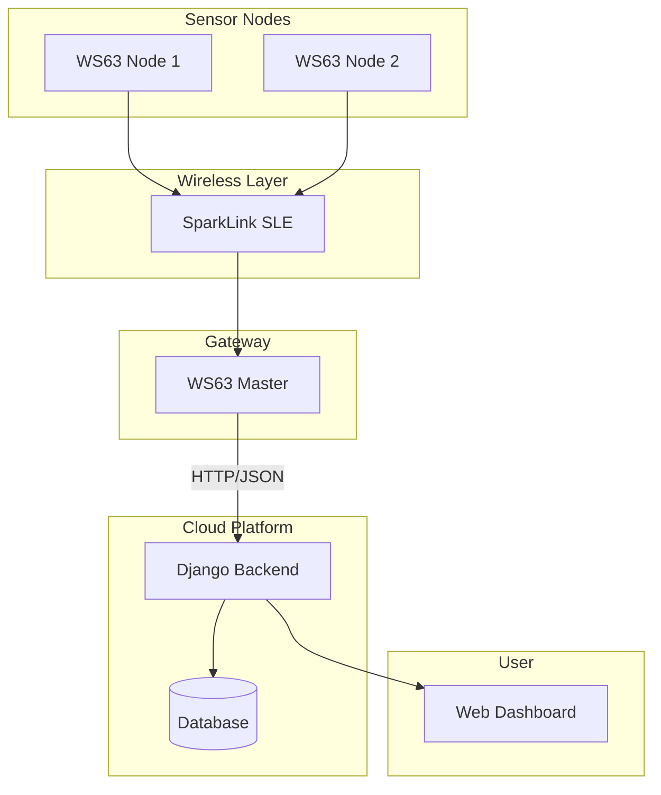

# 基于星闪（SLE）的智能药品监管系统

演示视频：https://www.bilibili.com/video/BV1E4TK6eEus/

[🇨🇳 中文](README.md) | [🇺🇸 English](README_EN.md)

## Why this project

目前关于星闪（SparkLink / SLE）的开源项目较少，
尤其缺少完整的：

传感器采集 → SLE无线传输 → 云端上传 → Web监控

全链路工程案例。

本项目提供一个可直接运行的参考实现。
演示链接https://www.bilibili.com/video/BV1E4TK6eEus/

## 项目简介

本项目是一个基于星闪 SLE（SparkLink Low Energy）通信技术的智能药品监管系统，采用 WS63 嵌入式平台开发，实现多节点分布式数据采集、无线传输与云端远程监控。

系统采用“1主控 + 2从控”架构：
- 两个从节点分别部署在不同药品/机柜中，负责采集各自环境数据
- 通过 SLE（星闪）将数据发送至主控节点
- 主控节点进行数据汇总处理后，通过 HTTP 上传至云端服务器
- 用户通过 Web 前端实现远程查看机柜运行状态与数据

## 系统架构



## 项目结构

```text
application/samples/

├── ws63_center_dev
│   └── Master Node
│       ├── SLE Receiver
│       ├── WiFi Connection
│       └── HTTP Upload

├── ws63_node_1
│   └── Slave Node 1
│       ├── Sensor Acquisition
│       └── SLE Transmission

├── ws63_node_2
│   └── Slave Node 2
│       ├── Sensor Acquisition
│       └── SLE Transmission

└── CMakeLists.txt
```

## 快速开始

本工程同一代码仓库包含服务端与客户端，需要通过修改 application/samples/CMakeLists.txt 选择编译目标

### 编译主控节点（server）

在 application/samples/CMakeLists.txt 中：

```cmake
add_subdirectory_if_exist(ws63_center_dev)

# add_subdirectory_if_exist(ws63_node_1)

# add_subdirectory_if_exist(ws63_node_2)
```

### 编译从节点1（client）

在 application/samples/CMakeLists.txt 中：

```cmake
# add_subdirectory_if_exist(ws63_center_dev)

add_subdirectory_if_exist(ws63_node_1)

# add_subdirectory_if_exist(ws63_node_2)
```
### 编译项目

```Python
~/project/smart_cabinet-main/build.py -c ws63-liteos-app
```
#  功能说明

## 1. 嵌入式底层驱动开发
- 基于 **WS63** 平台开发  
- 实现 **GPIO / PWM / UART / I2C / SPI / 单总线** 等外设驱动  
- 完成传感器接口封装与通信调试  
- 具备 **星闪 SLE 协议** 开发经验  

## 2. 星闪 SLE 多节点通信
- 构建 **主从式 SLE 无线通信网络**  
- 从节点独立采集数据并发送  
- 主节点统一接收并解析多设备数据  
- 实现 **低延迟、高稳定无线传输**  

## 3. CMSIS-RTOS 多线程系统设计
- 基于 **CMSIS-RTOS** 实现任务调度  
- 任务拆分为：**采集 / 通信 / 上传**  
- 提升系统并发能力与实时性  
- 避免任务阻塞与资源竞争  

## 4. 云端数据交互（IoT 系统）
- 主控节点通过 **HTTP** 向 **Django 后端** 上传数据  
- 使用 **JSON 格式** 进行设备数据传输  
- 支持云端实时存储与更新  
- 前端实现远程可视化监控  

## 5. 系统调试与优化
- 定位任务阻塞与堆栈溢出问题  
- 优化 **SLE 通信时序与稳定性**  
- 提升长时间运行可靠性  
- 完成嵌入式系统全流程调试  


#  技术栈

### 嵌入式端
- **WS63**
- **C / CMake**
- **CMSIS-RTOS**
- **SLE（星闪通信）**
- **UART / GPIO / I2C / SPI**

### 云端
- **Django**
- **HTTP / REST API**
- **JSON**

### 前端
- **Web 可视化界面**


#  项目亮点
- 基于 **星闪 SLE** 的多节点无线通信系统设计与实现  
- 完成从 **传感器采集 → SLE 传输 → 云端存储 → Web 展示** 完整链路  
- **主从式嵌入式分布式系统架构设计**  
- **CMSIS-RTOS 多线程任务调度与系统优化** 经验  
- 具备复杂嵌入式系统调试与问题定位能力  
- **IoT 设备端与云端协同开发** 经验  


#  应用场景
- 智能药品存储监管  
- 多机柜环境监控系统  
- 物联网设备远程管理系统  
- 工业级低功耗无线监测系统  


#  说明
本项目为 **嵌入式 + IoT 综合实训项目**，重点体现：

-  星闪 SLE 实际工程应用能力  
-  WS63 平台嵌入式开发能力  
-  多节点无线通信系统设计能力  
-  IoT 云端数据交互能力
